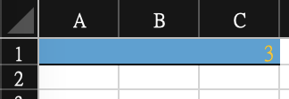

# 產學案 - 排程系統

## 打包程式

1. Install pyinstaller

    ``` sh
    pip3 install pyinstaller
    ```

2. 產生exe執行檔

    ``` sh
    pyinstaller -F [target python file]
    ```

## ExcelHandler

### Dependency

- [openpyxl](https://openpyxl.readthedocs.io/en/stable/)

### Install

``` sh
pip3 install openpyxl
```

### test

``` sh
python3 ExcelHandler.py
```

### excel 架構

- worksheet (excel檔案)
  - sheet1 (分頁，有title, row_height, column_width...等屬性)
    - cell A1 (有font, fill, color...等屬性)
    - cell B1 (column: A, B, ...)
    - cell A2 (row: 1, 2, ...)
    - ...
  - sheet2
    - ...

### Write Example

``` python
from ExcelHandler import ExcelHandler
from openpyxl.styles import PatternFill, Font, Border, Side

writer = ExcelHandler()
file = "test_handler.xlsx"
# created with at least one worksheet
writer.create_worksheet()
# add an new sheet (two sheets for now)
writer.create_sheet()
# get title of each sheet
titles = writer.get_sheet_titles()

#merge cells
writer.merge_cells(titles[0], start_row=0, start_col=0, end_row=0, end_col=2)
# set cell value
writer.set_cell_value(title=titles[0], row=0, col=0, value=3)  
# set cell font (字型 大小 粗體 斜體 底線 顏色...)
writer.set_cell_font(title=titles[0], row=0, col=1, font=Font("新細明體", sz=12, bold=False, italic=False, underline=None, color='FFFFC000'))
# set cell fill (底色)
writer.set_cell_fill(title=titles[0], row=0, col=2, fill=PatternFill(fill_type="solid", fgColor="FF46A2D5"))
# set cell border
writer.set_cell_border(titles[0], 0, 1, Border(bottom=Side(style='thin')))

# save file
writer.save_worksheet(file)
```

- Result



### Read Example

``` python
from ExcelHandler import ExcelHandler, get_color_value

file = "test_handler.xlsx"
reader = ExcelHandler(file)
# load file
reader.load()
# get title of each sheet
titles = reader.get_sheet_titles()

value = reader.get_cell_value(title=titles[0], row=0, col=1)
font = reader.get_cell_font(title=titles[0], row=0, col=0)
fill = reader.get_cell_fill(title=titles[0], row=0, col=0)
border = reader.get_cell_border(titles[0], row=0, col=0)

print(f"Value: {value}, Text Color: {get_color_value(font.color)}, Background color: {get_color_value(fill.fgColor)}")
print(f"Font: {font.name}, Size: {font.size}, Bold: {font.bold}, Italic: {font.italic}, Underline: {font.underline}")
print(f"Left: {border.left.style if border.left is not None else border.left}, ", end="")
print(f"Right: {border.right.style if border.right is not None else border.right}, ", end="")
print(f"Top: {border.top.style if border.top is not None else border.top}, ", end="")
print(f"Bottom: {border.bottom.style if border.bottom is not None else border.bottom}")
```

- Result

``` sh
Value: 3, Text Color: FFFFC000, Background color: FF46A2D5
Font: 新細明體, Size: 12.0, Bold: False, Italic: False, Underline: None
Left: None, Right: None, Top: None, Bottom: thin
```
